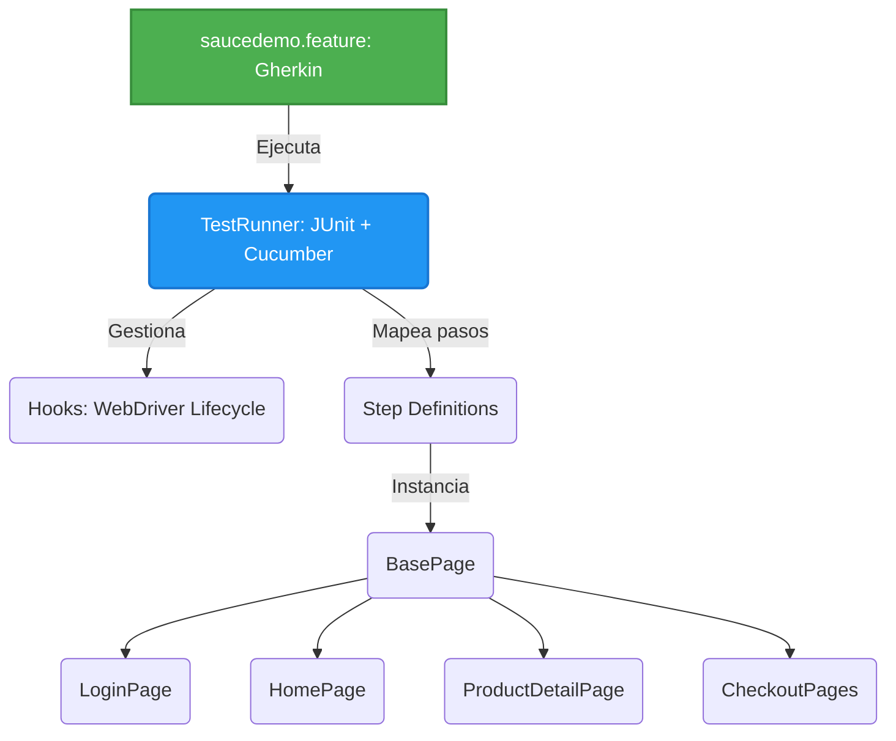

# CERTIFICACIÓN 2 - Framework BDD SauceDemo UI

Proyecto de automatización de pruebas BDD (Behavior Driven Development) para la plataforma de e-commerce SauceDemo. El objetivo principal es evaluar flujos críticos de negocio mediante pruebas E2E, integrando lenguaje natural (Gherkin) con el patrón Page Object Model (POM) y generación de reportes avanzados.

## Arquitectura del Proyecto (BDD + POM)

El framework está diseñado combinando Cucumber para la orquestación de comportamientos y Page Object Model (POM) apoyado por PageFactory para la interacción con la interfaz. Esta arquitectura garantiza que las especificaciones de negocio estén separadas de la implementación técnica.

## Stack Tecnológico

| **Herramienta**          | **Versión** | **Uso en el Proyecto**                                                     |
| ------------------------ | ----------- | -------------------------------------------------------------------------- |
| Java                     | 26          | Lenguaje de programación base.                                             |
| Selenium WebDriver       | 4.47.0      | Interacción y manipulación del DOM en el navegador.                        |
| Cucumber                 | 7.34.7      | Framework BDD para la definición y mapeo de pruebas en lenguaje Gherkin.   |
| JUnit                    | 6.1.3       | Motor de ejecución para los escenarios de Cucumber (`TestRunner`).         |
| WebDriverManager         | 6.3.4       | Gestión automática de los binarios del ChromeDriver.                       |
| Extent Reports 7 Adapter | 1.14.0      | Generación automática de reportes de prueba en formatos Spark, HTML y PDF. |
| Guava                    | 33.4.0-jre  | Validación algorítmica de ordenamiento en colecciones de datos.            |

## Escenarios Automatizados (Gherkin Concepts)

Se desarrollaron 5 escenarios de negocio. Todos comparten un **`Background`** que maneja la autenticación previa (`standard_user`), evitando redundancia en el código:

| **#** | **Escenario**               | **Concepto BDD**   | **Descripción de la Validación**                                                                                                                                          |
| ----- | --------------------------- | ------------------ | ------------------------------------------------------------------------------------------------------------------------------------------------------------------------- |
| 1     | Validación de código postal | `Scenario Outline` | Utiliza `Examples` para inyectar datos faltantes y verificar la activación de clases CSS de error dinámicas en el Checkout.                                               |
| 2     | Limpieza de sesión          | `Scenario`         | Comprueba la limpieza del carrito sincronizando esperas explícitas con la animación del menú lateral.                                                                     |
| 3     | Persistencia del carrito    | `Scenario`         | Verifica que el carrito mantenga su estado (State Management) al navegar entre vistas de catálogo y detalle.                                                              |
| 4     | Ordenamiento de catálogo    | `Scenario Outline` | Inyecta el criterio de ordenamiento "Price (high to low)" y confirma matemáticamente la clasificación descendente de los precios extraídos.                               |
| 5     | Cálculo total de precios    | `DataTable`        | Pasa una lista de productos a agregar desde el Feature, calcula el subtotal e impuestos con alta precisión (`BigDecimal`) y lo compara con el total final de la pasarela. |

## Resultados de las Pruebas y Reportes

Se ejecutó la suite mediante la clase `TestRunner` utilizando JUnit. Al finalizar, el plugin de ExtentReports autogenera la carpeta `test-output` con métricas detalladas.

**Resultado de la ejecución:**

| **Indicador**              | **Resultado**                                    |
| -------------------------- | ------------------------------------------------ |
| Casos de prueba ejecutados | 5                                                |
| Casos de prueba fallidos   | 0                                                |
| Reportes Generados         | `Spark.html`, `ExtentHtml.html`, `ExtentPdf.pdf` |
| Exit code                  | `0`                                              |

> **Nota Técnica sobre CDP:** Durante la ejecución en consola puede observarse una advertencia indicando que el navegador (Chrome v153) busca un protocolo CDP exacto pero Selenium 4.47.0 empareja con la v151. Esto es un aviso estándar de compatibilidad de DevTools que **no afecta en absoluto** la ejecución ni la integridad de las pruebas E2E.

## Ejecución Local

1. Clonar el repositorio en el equipo local.
2. Abrir el proyecto en IntelliJ IDEA.
3. Sincronizar Maven (botón *Reload All Maven Projects*) para descargar dependencias.
4. Navegar a `src/test/java/runners/TestRunner.java` y ejecutar la clase.
5. Una vez finalizada la ejecución, abrir la carpeta autogenerada `test-output/` en la raíz del proyecto para visualizar los reportes (ej. abrir `SparkReport/Spark.html` en el navegador).
